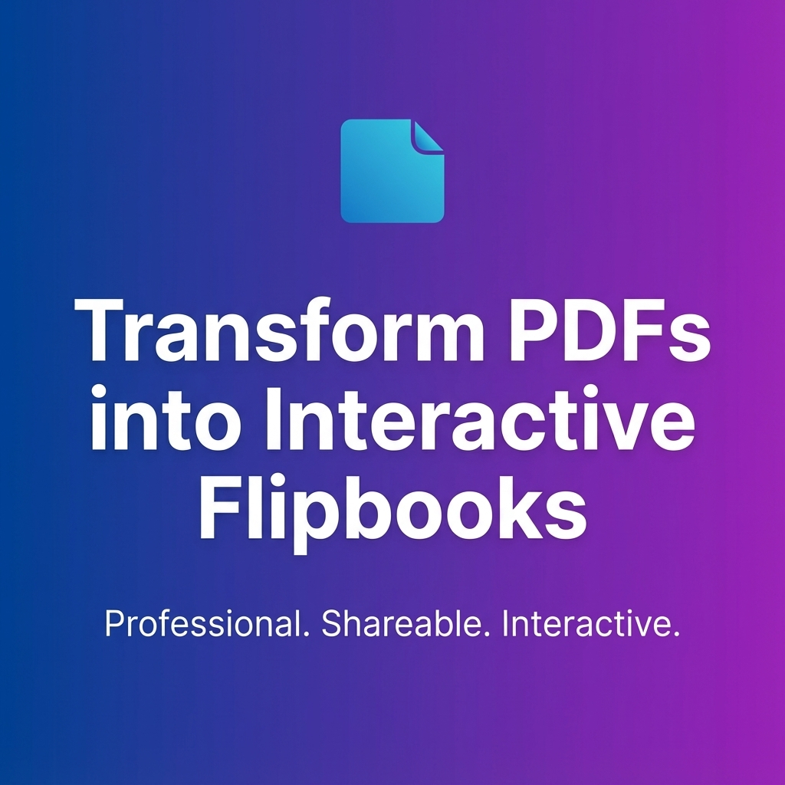

<div align="center">
  <a href="https://github.com/Soham407/FlipFlow">
    
  </a>

  <h3 align="center">Turn static PDFs into engaging, interactive flipbooks.</h3>

  <p align="center">
    FlipFlow is a modern SaaS platform designed for professionals who need a superior way to share documents. <br />
    Unlike standard PDF attachments, FlipFlow converts catalogs, portfolios, reports, and brochures into immersive, 3D-interactive flipbooks accessible via a unique, shareable link.
  </p>

  <p align="center">
    
    
  </p>
</div>

## 🔍 Overview

FlipFlow solves the engagement problem of static files. It provides a seamless pipeline for users to upload documents, manages hosting via high-performance cloud storage, and renders content in a refined, responsive viewer. Built with scalability in mind, the architecture separates high-bandwidth storage (Cloudflare R2) from application logic (Supabase), ensuring performance even under heavy load.



The platform operates on a tiered subscription model, offering advanced features like increased file size limits and storage capacities for premium users.

## ✨ Key Features

- **Interactive Viewer:** seamlessly renders PDFs with realistic page-turning effects using `dflip.js`.
- **Cloud Scalability:** specialized storage architecture using Cloudflare R2 for high-performance, low-cost asset delivery.
- **User Dashboard:** Centralized management hub for uploading, deleting, and organizing flipbooks.
- **Subscription Management:** Multi-tier SaaS logic (Free, Starter, Hobby, Business, Pro) with enforced usage limits.
- **Secure Authentication:** Robust sign-up and login flows backed by Supabase Auth.
- **Analytics:** Integrated view counting and performance tracking for every flipbook.
- **Payment Integration:** Seamless payment processing via Razorpay.
- **Responsive Design:** Fully mobile-optimized viewer and dashboard interface.

## 🏗️ Project Structure

```text
src/
├── components/        # Reusable UI components (Shadcn/UI, custom)
│   ├── dashboard/     # Dashboard-specific widgets (Stats, Cards)
│   └── ui/            # Core atomic design elements
├── config/            # Global constants and configuration
├── hooks/             # Custom React hooks (useAuth, useFlipbooks)
├── integrations/      # External service clients (Supabase)
├── lib/               # Utility libraries (Analytics, R2 helpers)
├── pages/             # Main application views (Viewer, Index, Login)
└── types/             # TypeScript definitions
supabase/
├── functions/         # Edge functions for payments and R2 logic
└── migrations/        # SQL schema definitions for the database
public/
└── lib/               # Static assets for the DFlip library
```

## 🧩 Tech Stack

**Frontend**

- **Framework:** React 18 (Vite)
- **Language:** TypeScript
- **Styling:** Tailwind CSS
- **Components:** shadcn/ui (Radix UI)
- **State Management:** React Query (@tanstack/react-query)
- **Routing:** React Router DOM

**Backend & Infrastructure**

- **BaaS:** Supabase (PostgreSQL, Auth, Edge Functions)
- **Storage:** Cloudflare R2 (Object Storage)
- **Payments:** Razorpay
- **Rendering Engine:** DFlip.js

## 🚀 Installation

Follow these steps to set up the environment locally.

### Prerequisites

- Node.js (v18 or higher)
- npm or bun
- A Supabase project
- A Cloudflare R2 bucket

### Setup

1.  **Clone the repository**

    ```bash
    git clone [https://github.com/Soham407/FlipFlow.git](https://github.com/Soham407/FlipFlow.git)
    cd FlipFlow
    ```

2.  **Install dependencies**

    ```bash
    npm install
    ```

3.  **Configure Environment Variables**
    Create a `.env` file in the root directory and add your credentials:

    ```env
    VITE_SUPABASE_URL=your_supabase_url
    VITE_SUPABASE_ANON_KEY=your_supabase_anon_key
    # Add other necessary keys for Razorpay/Cloudflare as required by your Edge Functions
    ```

4.  **Run the Development Server**

    ```bash
    npm run dev
    ```

    The app should now be running at `http://localhost:8080`.

## ⚙️ Configuration

### Database Setup

This project uses Supabase. You can apply the database schema found in the `supabase/migrations` folder to your local or remote instance to set up the required tables (`flipbooks`, `profiles`, `subscriptions`, etc.) and Row Level Security (RLS) policies.

### Storage Migration

Ensure your Cloudflare R2 bucket is configured to allow public read access for the flipbook assets, as the application logic relies on generating public URLs for the viewer.

## ▶️ Usage

1.  **Sign Up/Login:** Create an account through the `/login` page.
2.  **Dashboard:** Navigate to the dashboard to view your usage stats.
3.  **Upload:** Click "New Flipbook," select a PDF (size limit depends on your tier), and wait for the upload to complete.
4.  **Share:** Copy the generated public link and share it. The link opens the immersive viewer.

## 📦 Deployment

The frontend is optimized for deployment on **Vercel**.

1.  Push your code to a Git repository.
2.  Import the project into Vercel.
3.  Add the environment variables (Supabase keys) in the Vercel dashboard.
4.  Deploy.

_Note: Ensure your Supabase Edge Functions are deployed separately using the Supabase CLI._

## 🗺️ Roadmap

- [ ] **Advanced Analytics:** Integration with deeper tracking for page-level engagement.
- [ ] **Custom Branding:** Allow Pro users to remove branding and add custom logos.
- [ ] **Custom Domains:** Support for white-labeled domains (e.g., `books.client.com`).
- [ ] **Password Protection:** Private flipbooks secured by access codes.

## 🤝 Contributing

Contributions are welcome\! Please feel free to submit a Pull Request.

1.  Fork the project
2.  Create your feature branch (`git checkout -b feature/AmazingFeature`)
3.  Commit your changes (`git commit -m 'Add some AmazingFeature'`)
4.  Push to the branch (`git push origin feature/AmazingFeature`)
5.  Open a Pull Request

## 📄 License

Distributed under the MIT License. See `LICENSE` for more information.
